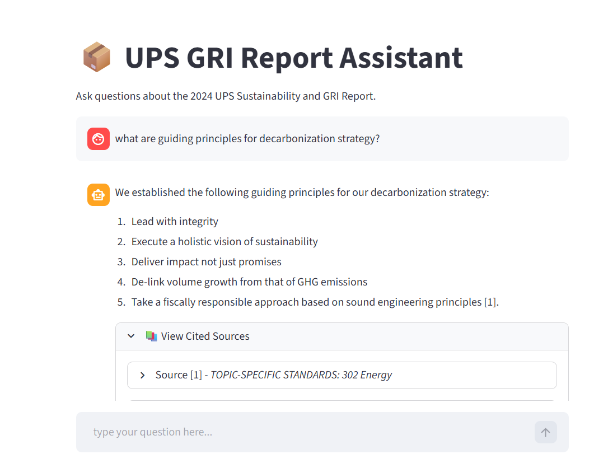

# UPS RAG SYSTEM

A lightweight retrieval-augmented generation (RAG) demo built with Streamlit, LangChain, Chroma, and BM25.

## Features

- Ingests a PDF as chunks and stores them in a Chroma vector store
- Uses a sentence-transformer embedding model for semantic retrieval
- Maintains a BM25 retriever for hybrid retrieval
- Exposes a Streamlit chat app with inline-cited sources
- Configurable models via environment variables and model factory

## Requirements

- Python 3.13+
- `uv` for dependency sync (project expects `uv sync`)

## Setup

1. Create and activate your virtual environment.
    ```powershell
    python -m venv .venv
    .venv\Scripts\Activate.ps1
    ```

2. Install dependencies:
   ```powershell
   uv sync
   ```

3. Copy the environment template:
   ```powershell
   cp .env_example .env
   ```

4. Configure `.env` as needed.
   - At minimum, set `HUGGINGFACEHUB_API_TOKEN` and `GROQ_API_KEY`
   - You can change the model and their providers from `src/model_factory`

## Ingest the knowledge base

Place your source PDF in the `data/` folder and name it exactly:

- `data/AI Enginner Use Case Document.pdf`

Then run:

```powershell
py .\src\rag\ingestion.py
```

This will:

- extract and chunk the PDF content
- create embeddings using `BAAI/bge-small-en-v1.5`
- persist the Chroma vector store under `vector_stores/chroma_store`
- build the BM25 index under `vector_stores/bm25_store`

## Run the Streamlit app

```powershell
streamlit run .\src\streamlit\app.py
```

Open the local Streamlit URL shown in the terminal, then ask questions in the chat input.

## Screenshots
<p align="center">
  
</p>

## Design Decisions

- **PDF Loading Strategy (Markdown Extraction) using `pymupdf4llm`**: Standard PDF loaders extract text linearly, which completely destroys the layout of complex data tables. I used pymupdf4llm to convert the PDF directly into Markdown. This preserves the document's header hierarchy and keeps structural elements (like multi-column emissions tables) intact for downstream processing.
- **Chunking Strategy (Markdown-Aware & Enriched) using `MarkdownHeaderTextSplitter` and `RecursiveCharacterTextSplitter` with markdown language**: I utilized LangChain's RecursiveCharacterTextSplitter.from_language(Language.MARKDOWN) to ensure chunk splits respect table boundaries and paragraphs.
    - The chunk size was strictly limited to 1000 characters to prevent silent truncation by the embedding model's 512-token limit.
    - Metadata Enrichment: A custom preprocessing function injects the hierarchical parent headers (e.g., GRI 302 > 302-1 Energy) directly into the page_content of every chunk. This guarantees the embedding model never loses semantic context.
- **Embedding Model (`BAAI/bge-small-en-v1.5`)**: I implemented local, open-source embeddings using the official langchain-huggingface integration. I selected a highly efficient model (like BAAI/bge-small-en-v1.5) that processes the chunks securely on the local CPU, ensuring no proprietary data is sent to third-party embedding APIs.
- **Vector Store (`ChromaDB`)**: I selected Chroma for its lightweight, serverless nature. It persists directly to the local file system (./vector_store), meaning I don't need to spin up a Docker container or connect to a cloud database just to test the application.
- **Retrieval Strategy (Hybrid Search via RRF)**: Semantic search alone frequently fails to retrieve exact keyword matches like "Scope 1" or specific index codes like "GRI 302-1". I implemented a dual-retriever architecture using LangChain's EnsembleRetriever, combining the contextual power of ChromaDB (Semantic Search) with the exact-match precision of BM25 (Keyword Search).
- **LLM Selection (`llama-3.1-8b-instant` via Groq)**: To fulfill the open-source requirement, I utilized `llama-3.1-8b-instant` hosted on Groq. This provides state-of-the-art open-source reasoning with near-instantaneous API inference speeds.
- **Architecture / UI Strategy (Standalone Streamlit)**: While the backend logic is strictly modularized within src/rag/ to allow for future API/microservice separation, I intentionally bypassed FastAPI for this deliverable. Tightly coupling the RAG core directly to Streamlit reduces deployment complexity to a single terminal command, prioritizing user experience and ease of testing.

## Limitations

- **Handling Multi-Page Tables**: While the Markdown extraction strategy preserves layout much better than raw text extraction, massive data tables spanning multiple PDF pages can still exceed the BAAI/bge-small-en-v1.5 model's 512-token limit. Chunking these massive tables can occasionally disconnect bottom rows from their parent column headers.
- **Multi-Hop Reasoning**: The hybrid RAG system excels at direct fact retrieval and specific keyword lookups. However, highly complex, cross-document synthesis questions (e.g., "Analyze the trend of Scope 1 emissions relative to the board diversity percentage over the last 3 years") may struggle if the required facts are scattered across more chunks than the retriever's top-K limit can fetch.

## Future scope
- **Agentic Table Summarization**: Implement an LLM pre-processing step during data ingestion. By passing complex Markdown tables to a fast LLM to generate a natural language summary, we can embed that summary alongside the raw table data to drastically improve semantic retrieval accuracy.
- **Response Streaming**
- **Evaluation**
